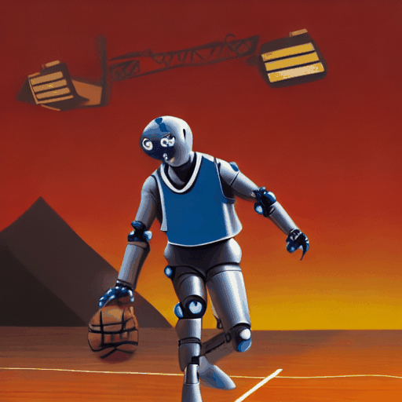
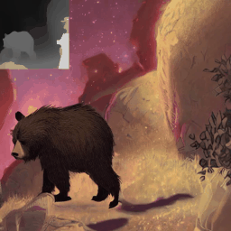
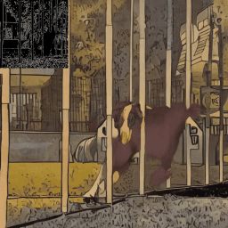
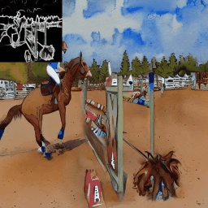

# control-a-video
<!--  -->
Official Implementation of ["Control-A-Video: Controllable Text-to-Video Generation with Diffusion Models"](https://arxiv.org/abs/2305.13840), which is a text-based vid2vid model similar to [GEN-1](https://research.runwayml.com/gen1), more showcases in [Project Page](https://controlavideo.github.io).

The models and code can only be used for non-commercial/research purpose.

Similar to Controlnet, We otain the condition maps from another video, and we support three kinds of control maps at this time. 

|depth control| canny control | hed control | 
|:-:|:-:|:-:|
|<br> a bear walking through stars |<br> a dog, comicbook style |<br> person riding horse, watercolor|


# Setup

The model has been tesed in torch version: `1.13.1+cu117`, simply run
```
pip3 install -r requirements.txt
```

# Usage

## 1. Quick Use
We provide a demo for quick testing in this repo, simply running:

```
python3 inference.py --prompt "a bear walking through stars, artstation" --input_video bear.mp4 --control_mode depth 
```

Args:
- `--input_video`: path of input video(mp4 format).
- `--num_sample_frames`: nums of frames to generate. (recommend > 8).
- `--sampling_rate`: skip sampling from the input video.

- `--control_mode`: allows for different control, currently support **`canny`, `depth`, `hed`**. (you need to download the weight of **hed** annotator from [link](https://huggingface.co/wf-genius/controlavideo-hed/resolve/main/hed-network.pth) and put it in work space.)
- `--video_scale`: guidance scale of video consistency, borrows from GEN-1. (don't be too large, 1~2 work well, set 0 to disable it.)
- `--init_noise_thres`: the propoed threshold of residual-based noise init. (range from 0 to 1, larger value leads to more smooth but may introduce artifacts.)

- `--inference_step, --guidance_scale, --height, --width, --prompt`: same as other T2I model.

If the automatical downloading not work, the models weights can be downloaded from: [depth_control_model](https://huggingface.co/wf-genius/controlavideo-depth), [canny_control_model](https://huggingface.co/wf-genius/controlavideo-canny), [hed_control_model](https://huggingface.co/wf-genius/controlavideo-hed).

## 2. Pipeline
### Inference
(1) Our model firstly generates the first frame, which can be used fro preview. 
```
first_frame = video_controlnet_pipe(
        controlnet_hint=control_maps[:,:,0:1,:,:],
        prompt=testing_prompt,
        num_inference_steps=20,
        width=w,
        height=h,
        guidance_scale=10,
        num_images_per_prompt=1,
        generator=[torch.Generator(device="cuda").manual_seed(seed)],
        fix_first_frame=False,
).images[0]
if isinstance(first_frame, list):
    first_frame = first_frame[0]    # PIL image, can be shown in jupyter.
```

(2) Once We get the first frame, we generate the subsquent frames conditioned on the first frame.
```
out = video_controlnet_pipe(
        controlnet_hint= control_maps[:,:,:num_each_frames,:,:],
        images= v2v_input_frames[:,:,:num_each_frames,:,:],
        prompt=testing_prompt,
        num_inference_steps=20,
        width=w,
        height=h,
        guidance_scale=10,
        generator=[torch.Generator(device="cuda").manual_seed(seed)],
        single_frame_noise_addition_scale = 1.5,        
        first_frame_output= first_frame,   # provide the first frame
        init_noise_by_residual_thres = 0.1,
).images[0][1:] # drop the first frame
```

(3) You can set `first_frame_output=out[-1]` and generate longer videos. (Note that the `controlnet_hint` and `images` shoule be the coressponding frames, and the frst item should be same as `first_frame_output`) This operation is still under experiment and it may collaspe after 3 or 4 iterations. 


### Replace the 2d model
Since we freeze the 2d model, you can replace it with any other model based on `stable-diffusion-v1-5`.

```
state_dict_path_condidates = glob.glob(os.path.join(pipeline_path, 'unet', "*.bin"))
state_dict = torch.load(state_dict_path_condidates[0], map_location="cpu")
unet.load_2d_state_dict(state_dict=state_dict)
```

# Citation
```
@misc{chen2023controlavideo,
        title={Control-A-Video: Controllable Text-to-Video Generation with Diffusion Models}, 
        author={Weifeng Chen and Jie Wu and Pan Xie and Hefeng Wu and Jiashi Li and Xin Xia and Xuefeng Xiao and Liang Lin},
        year={2023},
        eprint={2305.13840},
        archivePrefix={arXiv},
        primaryClass={cs.CV}
    }
```

# Acknowledgement
This repository borrows heavily from [Diffusers](https://github.com/huggingface/diffusers), [ControlNet](https://github.com/lllyasviel/ControlNet), [Tune-A-Video](https://github.com/showlab/Tune-A-Video), thanks for open-sourcing! This work was done in Bytedance, thanks for the cooperators! 


# Future Plan
- support segmentation(mask) generation.
- video lora/dreambooth.
- optical flow enhancement.
- Any other methods to improve the model. It's also welcomed to contribute any applications based on our models, feel free to contact me and propose a PR.